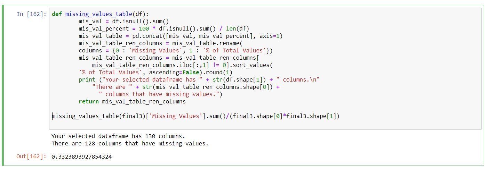
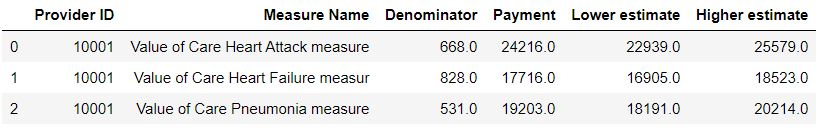
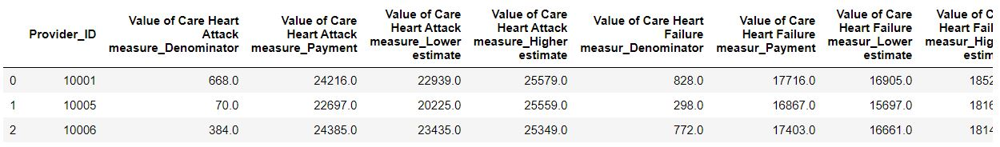
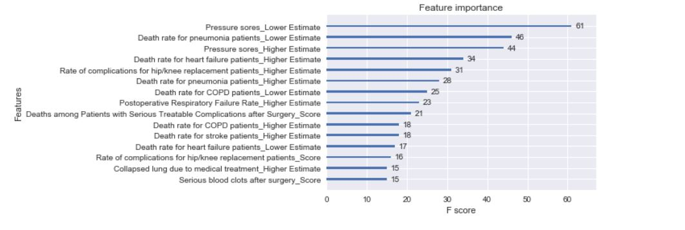
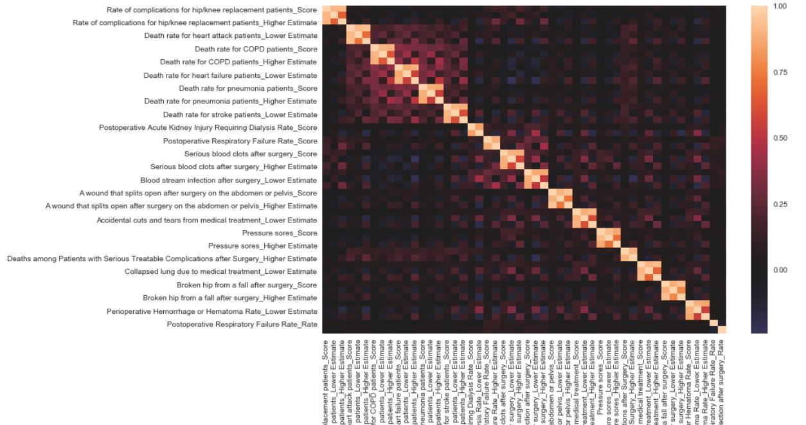
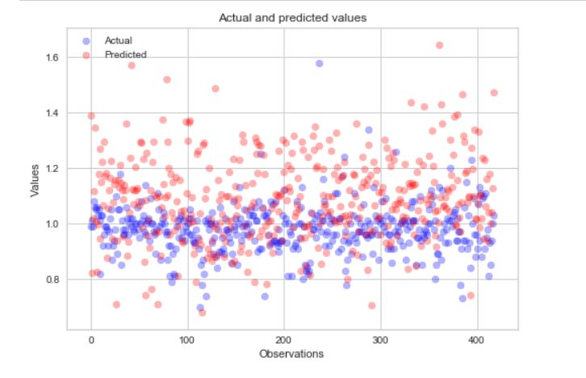
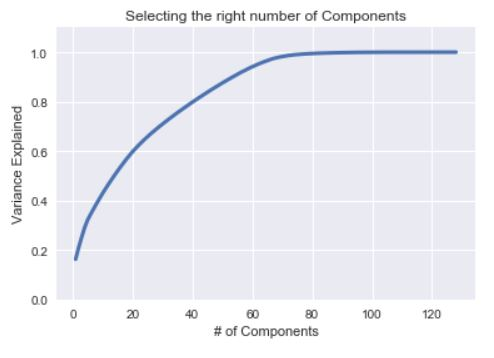
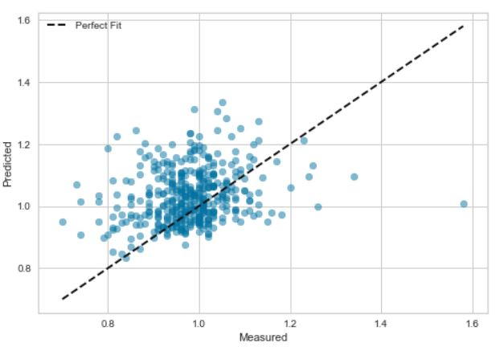
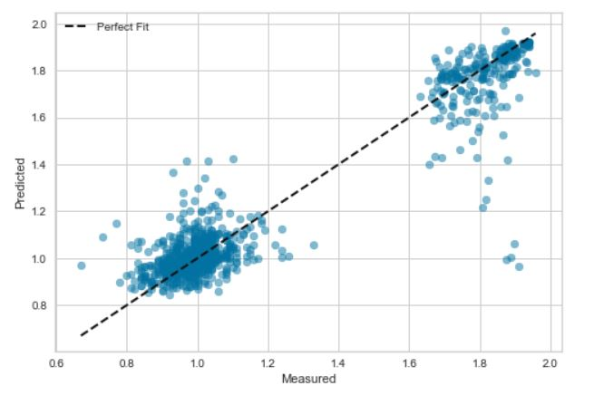

#  Evaluating Hospital Effectiveness with Government Data
by Thien Nguyen

[Blog](https://thiennguyen.blog/)

## Motivation

The US health care system is often shrouded in mystery. Hospitals purposely hide their chargemaster lists, so it is impossible for free-market pressures to lower prices. Consumers are burdened with choosing the best health care without any metric to go by, other than hospital advertising. This project aims to find a way to allow consumers to find the best, most affordable hospital in order to allow economic pressure into the health care system.

## Table of Contents

**Data** - contains individual metrics of hospitals along with the target metric (spending score)

**Images**- images for readme file

**EM - Exploratory Data Analysis** - Part II - Explored data and constructed OLS, RandomForest, and XGBoost models to predict data

**OS- Obtaining, Organizing, Scrubbing** - Part I - Modified metrics from Data folder to create KNN_df, pure_df, and null_df.

**KNN_df** - Complete dataset containing imputed information with no NaN

**pure_df** - Incomplete (does not contain all providers) dataset with no imputed values and no NaN

**null_df** - Complete dataset containing all true values (no imputation) **with** NaN values

*All data within the Data folder was extracted from https://www.medicare.gov/

## Foreword

This investigation proves ultimately inconclusive in the end due to a lack of data:

The image above shows that 128 out of 130 columns contained null values. Altogether, 33% of the final dataframe after merging dataframes within the *Data* folder contain null values. Psuedolabeling the target variable and KNN imputation preserved data but only at the expense of test accuracy. When machine learning models were tested against pure data, a group of providers with no missing data, accuracy plummeted, as inferred data proved to be substantially different than real-world data.

## Jupyter Notebooks

### OS-Obtaining & Scrubbing
Files in Data folder were cleaned: both NaN values and placeholder nulls were removed. Features about location and redundant names and footnotes were also removed.
To merge all five dataframes, each one was reformatted, so each provider could be assigned a single row. See example below:

### Pre-Processed 

 

### Post-Processed

Doing so reintroduced a lot of null values since each provider did not have the same amount of information present. Pseudolabeling was used to fill missing the missing target (Spending) variable while KNN imputation filled in the rest of the null values.

### EMN- Exploring, Modeling, and Interpretation

1. Half of pure data was used as test data, while the other half was in the train data along with the imputed information.
2. Features were scaled and outliers (points over 3 standard deviations) were dropped.
3. Stepwise selection and RFE ranked feature importance.

4. Heatmap constructed from selected features to check multicollinearity

5. OLS model constructed and compared to test data with r2 = -3.83
Low R2 most likely due to imputation and small test data.

6. Determined Optimal components for 95% Variance: 62 Components

7. Pipeline Random Forest and XGBoost with PCA Analysis and evaluated against test data. 

8. Retested again comprehensive dataframe with random split

*There seems to be some possible clustering here. More investigation needed to determine if this is a natural occurence, or if it is due to data imputation.*

## Conclusion
The investigation proved inconclusive as no model was able to predict the test data.
Potential Issues included:
1. Small quantity of target variable
2. Reintroduction of null values due to merging datasets
3. Imputation method oversimplified data
4. Too much data dropped in Obtaining and Scrubbing (due to small target variable)

## Future Consideration
1. Webscrape additional or alternative cost data for each provider
2. Oversample "pure" data to make models more sensitive to "real" data
3. Investigate possible clustering
